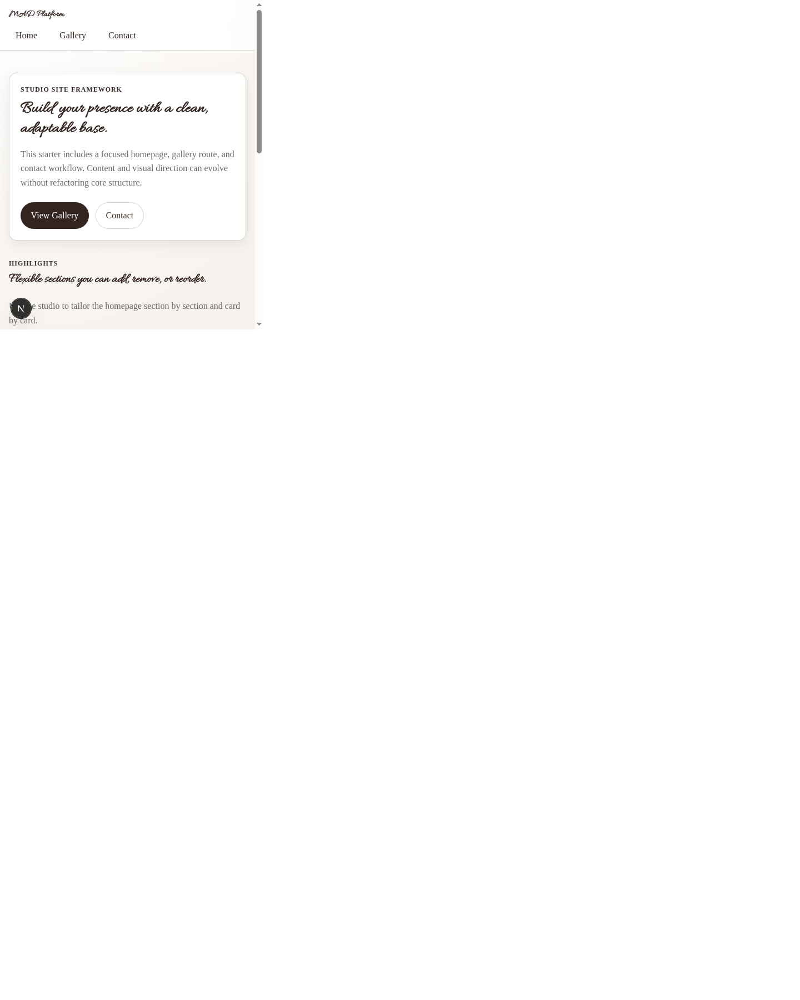
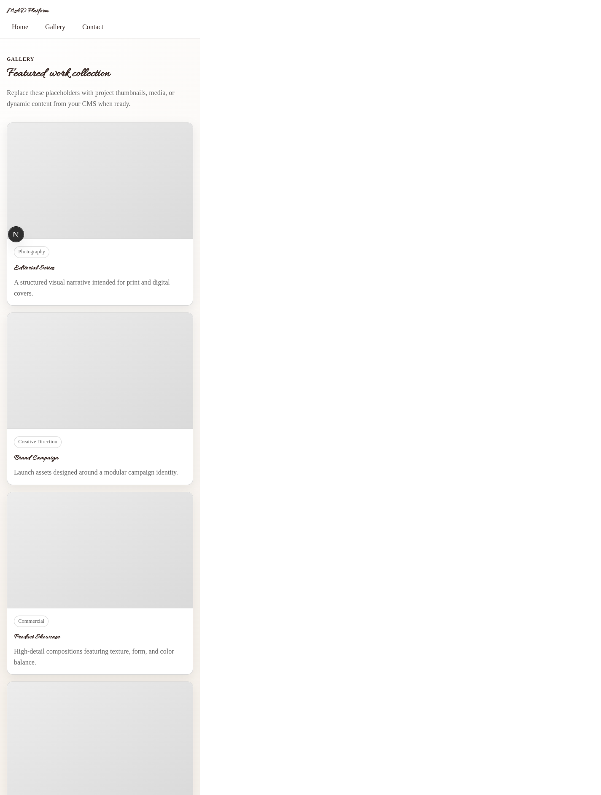
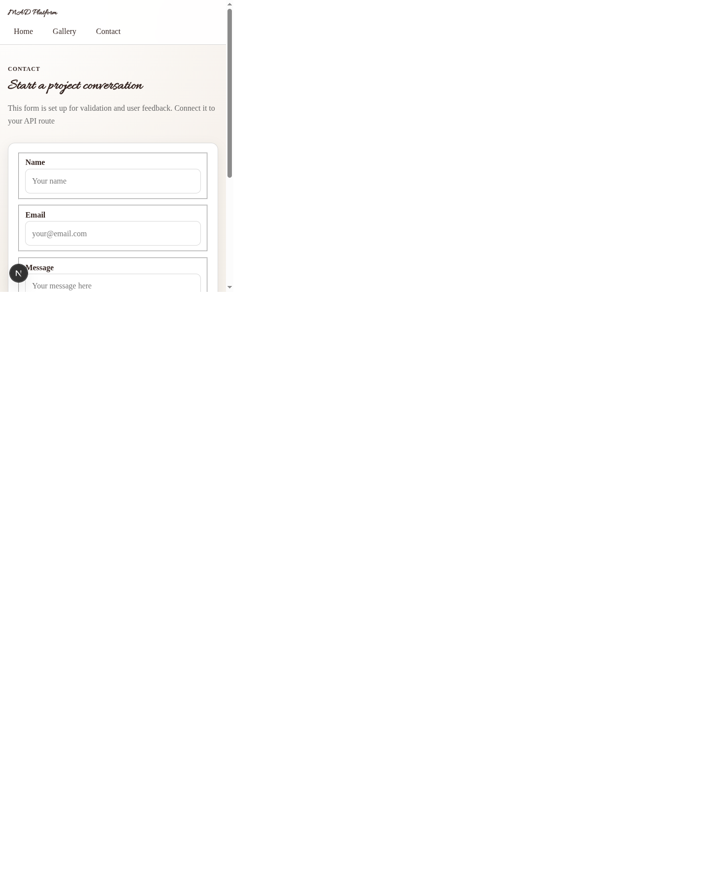

# Studio User Guide

This Studio is the content editor for the MAD Platform site. The live site is split across three main routes:

- Home: `/`
- Gallery: `/gallery`
- Contact: `/contact`
- Studio: `/studio`

If a document is missing, the site falls back to built-in placeholder content so the page still renders.

## Screenshots

These screenshots show the current live routes and help you see where each Studio entry appears on the site.

### Home page

### Gallery page

### Contact page

## What each entry controls

### Home Page

The `Home Page` document controls the content on `/`.

The page is built from a `Sections` array, and the order in the Studio is the order shown on the page.

Section placement on the page:

- `Hero Banner` appears as the large opening section at the top of the page.
- `Card Grid` appears as a grid of cards below the hero.
- `Text Block` appears as a simple text-only content section.
- `Call to Action` appears as a closing CTA panel.

#### Hero Banner fields

| Field | What it controls | Example content |
| --- | --- | --- |
| `eyebrow` | Small label above the headline | `Welcome to the studio` |
| `title` | Main hero heading | `Build a homepage without touching code.` |
| `copy` | Supporting paragraph | `Add, remove, and rearrange sections from the Studio. Each block can be tailored to your brand, projects, and calls to action.` |
| `primaryActionLabel` | Main button text | `View Gallery` |
| `primaryActionHref` | Main button link | `/gallery` |
| `secondaryActionLabel` | Secondary button text | `Contact` |
| `secondaryActionHref` | Secondary button link | `/contact` |

#### Card Grid fields

| Field | What it controls | Example content |
| --- | --- | --- |
| `eyebrow` | Small label above the section title | `Homepage cards` |
| `title` | Section heading shown above the cards | `Change cards freely` |
| `copy` | Short intro paragraph for the card group | `Use this section for featured work, services, announcements, or anything else you want to highlight.` |
| `cards` | The list of homepage cards | Two cards in the default content |

#### Card fields inside `cards`

| Field | What it controls | Example content |
| --- | --- | --- |
| `eyebrow` | Small tag on each card | `Featured` |
| `title` | Card title | `Curated Work` |
| `description` | Card body copy | `Showcase projects, campaigns, or stories that matter most.` |
| `linkLabel` | Card button text | `Open gallery` |
| `linkHref` | Card button link | `/gallery` |

| Field | What it controls | Example content |
| --- | --- | --- |
| `eyebrow` | Small tag on the second card | `Process` |
| `title` | Second card title | `Simple Flow` |
| `description` | Second card body copy | `Guide visitors toward the next step with a clear path.` |
| `linkLabel` | Second card button text | `Contact us` |
| `linkHref` | Second card button link | `/contact` |

#### Text Block fields

| Field | What it controls | Example content |
| --- | --- | --- |
| `eyebrow` | Small label above the block | `Studio notes` |
| `title` | Text block heading | `A simple content section` |
| `copy` | Paragraph text for the block | `Use this area for supporting copy, about text, or a short announcement.` |

#### Call to Action fields

| Field | What it controls | Example content |
| --- | --- | --- |
| `eyebrow` | Small label above the CTA | `Next step` |
| `title` | CTA heading | `Need a custom section?` |
| `copy` | CTA supporting text | `Add another block and tailor it to match the content you want on the page.` |
| `buttonLabel` | CTA button text | `Open Studio` |
| `buttonHref` | CTA button link | `/studio` |

The homepage code also supports reordering sections, so you can change the narrative flow without changing code.

### Portfolio Card

Each `Portfolio Card` document controls one tile on `/gallery`.

The gallery page renders all `galleryItem` entries and sorts them newest-first.

| Field | What it controls | Example content |
| --- | --- | --- |
| `title` | Card title shown in the gallery grid | `Editorial Series` |
| `category` | Short label or chip above the title | `Photography` |
| `description` | Supporting text under the title | `A structured visual narrative intended for print and digital covers.` |
| `image` | Card image shown in the grid | A portrait, project cover, or final selected asset |

If a card has no image, the page shows a placeholder instead, but the document still appears in the gallery list.

### Contact Page

The `Contact Page` document controls the copy at the top of `/contact`.

| Field | What it controls | Example content |
| --- | --- | --- |
| `eyebrow` | Small label above the heading | `Contact` |
| `heading` | Large page title | `Start a project conversation` |
| `sectionCopy` | Intro paragraph above the form | `This form is set up for validation and user feedback. Connect it to your API route` |
| `formSuccessMessage` | Message shown after a successful submission | `Thanks for reaching out. We'll get back to you soon!` |

The form fields themselves are built into the site code, so the Studio only controls the page copy and success state text.

## Suggested editing workflow

1. Edit the relevant document type in Preview Studio (dataset: `staging`).
2. Save the entry.
3. Check the matching Preview deployment page:
   - Home content on `/`
   - Gallery content on `/gallery`
   - Contact content on `/contact`
4. Use the preview/title in the Studio to confirm you edited the right document.
5. After approval, publish via Sanity Content Release so the change moves to production.

## Environment guardrails

- `main` branch maps to Vercel Production and Sanity dataset `production`.
- `dev` branch maps to Vercel Preview and Sanity dataset `staging`.
- All content edits must be validated in Preview before intentional release to Production.

## Quick reference

- Homepage sections are managed in one `Home Page` document.
- Gallery cards are managed one document per card.
- Contact page text is managed in one `Contact Page` document.
- The site has placeholder fallbacks, so missing content will not break the page.
